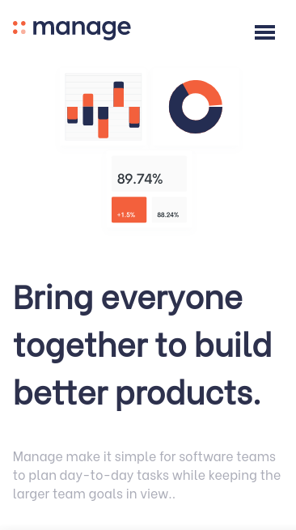
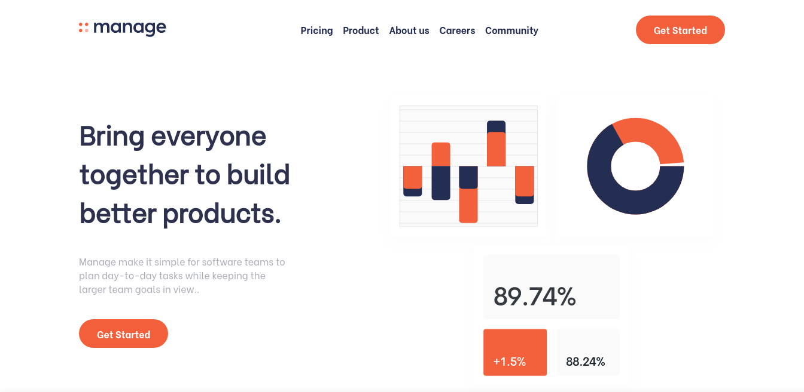

# **Manage landing page**

<div align="center">
  <h3>
    <a href="https://github.com/Tanosimboangy/Manage-landing-page">
      Source
    </a>
    <span> | </span>
    <a href="https://jacquit-manage-landing-page.netlify.app/">
      Demo
    </a>
  </h3>
</div>

## **Overview:**




## **Built With:**

- [HTML](https://developer.mozilla.org/en-US/docs/Web/HTML)
- [SASS](https://sass-lang.com/documentation)


## **Features:**
- Users can view the optimal layout for the site depending on their device's screen size.
- Users can see hover states for all interactive elements on the page.
- Users can see all testimonials in a horizontal slider.
- Users will receive an error message when the newsletter sign up `form` is submitted if:
  - The `input` field is empty.
  - The email address is not formatted correctly.

## **Design:**


## **Getting started:**

To clone and run this application, you'll need [Git](https://git-scm.com) and [Node.js](https://nodejs.org/en/download/) (which comes with either [npm](http://npmjs.com) or [yarn](https://yarnpkg.com/)) installed on your computer. From your command line:

```bash
# Clone this repository to your local machine
$ git clone https://github.com/Tanosimboangy/Manage-landing-page.git

# Install dependencies:
- npm install or yarn install

# Run the app
$ npm start or yarn start
```